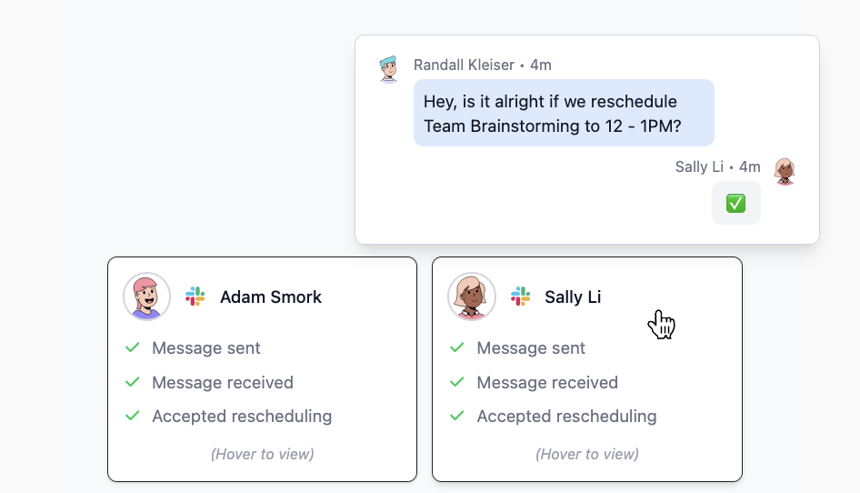

# calendar-condenser

Ever wish you could just smush your calendar events together to save space? Well, now you can!

     
    <i>Turn this...</i>
     
    
     
    <i>...into this...</i>
     
    
     
    <i>...without lifting a finger!</i>
     
    

## Features
m
- Automagically determine the best way to move around your calendar events to save space
- Respects conflicts of any invitees to your events and your preferred working hours
- Analyzes message responses to determine if your proposal was accepted or rejected
- Integrates directly with your calendar provider like Google Calendar*
- Sends messages directly with Slack*

* These are currently mocked out for development purposes. This project was mostly
about LangGraph, so I skimped on the actual integrations. Instead, I focused on the interfaces
I would expeect to integrate into their 'real' counterparts.

## Setup

See [docs/setup.md](docs/setup.md) for instructions on how to set up the project.
