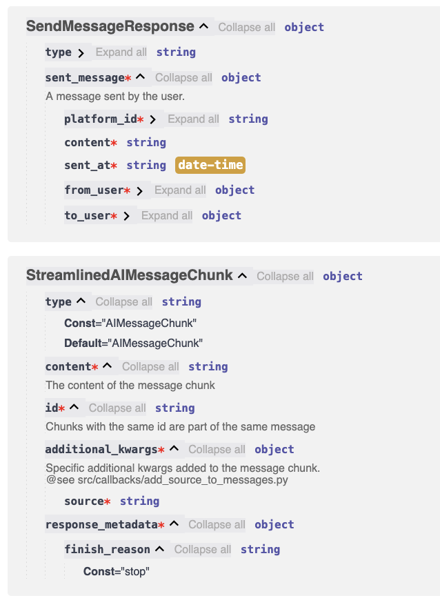

## Agents and OpenAPI

Author: [@jakemingolla](https://github.com/jakemingolla)

Published: 2024-09-11

## Overview

This document describes my approach to integrating agents with OpenAPI,
particularly in the context of a [LangGraph][langgraph] graph. I've found this is an excellent way to
both provide a more structured way to define your graph's signature for UI development and provide
a 1:1 mapping between your graph's nodes and the OpenAPI schema.

## Background

This is partially based off of my [previous blog post on state transitions](./2025-08-14-state-transitions.md), which
may be useful to read before continuing.

## Code Examples

For all of the [nodes in my graph](../../src/graph/nodes/), I define a corresponding return type in the
[src/types/rest_api.py](../../src/types/rest_api.py) file. This is either `None` (if the graph does not mutate the state)
or a custom `NodeResponse` type. Through the magic of [`fastapi`][fastapi], these can automatically turn into
an OpenAPI schema - each line in the resulting graph stream corresponds to one of the following types:

- An LLM message chunk (usually only a few characters)
- A graph update which represents a partial update to the state of the graph
- A subgraph update which includes a unique identifier for the subgraph invocation
- An interrupt which represents a request for user input by the graph
- A loading indicator which represents a message from the graph

Other structured types could be added to the API in the future based on the needs of the graph.

## Benefits

- Easy to describe how a particular node of the graph returns data to the client
  Given I was vibe-coding the entire front-end, I needed something tangible I could automatically
  generate to ensure I was describing the graph's behavior correctly
- Uses existing OpenAPI tools (which LLMs seem to be pretty comfortable with)

## Gotchas

- I don't know of any automated way to link together the graph definition to the type definition.
  This means it needs to be manually maintained and can be error-prone
- Not based on any LangGraph (or MCP, A2A, etc.) specification so any clients need to be custom-built

<!-- References -->
[langgraph]: https://langchain-ai.github.io/langgraph/
[fastapi]: https://fastapi.tiangolo.com/
